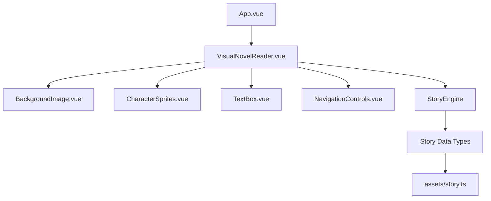

# Visual Novel Reader Design Document

## Overview

The Visual Novel Reader is a Vue 3 application that renders interactive visual novels with layered images, text dialogue, and navigation controls. The application uses a component-based architecture with TypeScript for type safety and the Vue 3 Composition API for reactive state management.

## Architecture

### High-Level Architecture



### Component Hierarchy

- **App.vue**: Root application component
- **VisualNovelReader.vue**: Main container managing story state and rendering
- **BackgroundImage.vue**: Displays scene background images
- **CharacterSprites.vue**: Renders character sprites with positioning
- **TextBox.vue**: Shows dialogue text with styling
- **NavigationControls.vue**: Provides next button and navigation logic

## Components and Interfaces

### Core Data Types

```typescript
// Basic types
type AssetId = string;
type CharId = string;
type PoseId = string;
type UISlot = "left" | "center" | "right";

// Main story structure
interface Story {
  version: "1.0";
  meta: {
    id: string;
    title: string;
  };
  assets: {
    backgrounds: Record<string, string>;
    characters: Record<
      CharId,
      { name: string; poses: Record<PoseId, string> }
    >;
  };
  scenes: Scene[];
}

interface Scene {
  id: string;
  label?: string;
  slides: Slide[];
}

interface Slide {
  id: string;
  initial?: {
    inherit?: boolean; // default true
    background?: AssetId;
    characters?: Record<
      UISlot,
      { id: CharId; pose: PoseId; x?: number; y?: number; z?: number }
    >;
    textbox?: { speaker?: string | null; text?: string };
  };
  steps: Action[][];
  next?: { scene?: string; slide?: string };
}

// Action types for state changes
type Action =
  | { type: "say"; text: string; speaker?: string }
  | { type: "setBackground"; id: AssetId }
  | { type: "showCharacter"; slot: UISlot; id: CharId; pose: PoseId; x?: number; y?: number; z?: number }
  | { type: "updateCharacter"; id: CharId; pose?: PoseId; slot?: UISlot; x?: number; y?: number; z?: number }
  | { type: "hideCharacter"; id: CharId }
  | { type: "transition"; name: "fade" | "cut" | "slide" | "flash"; ms: number }
  | { type: "wait"; ms: number };

// Runtime state for current slide
interface SlideState {
  background?: string;
  characters: Record<UISlot, {
    id: CharId;
    pose: PoseId;
    x?: number;
    y?: number;
    z?: number;
  }>;
  textbox?: {
    speaker?: string | null;
    text?: string;
  };
}
```

### State Management

The main VisualNovelReader component will manage:
- Current scene and slide indices
- Current step index within slide
- Accumulated slide state (with inheritance)
- Navigation availability

```typescript
// Reactive state structure
const storyState = reactive({
  currentSceneIndex: 0,
  currentSlideIndex: 0,
  currentStepIndex: 0,
  currentSlideState: {} as SlideState,
  isComplete: false
});

// State inheritance and action processing logic
function buildSlideState(story: Story, sceneIndex: number, slideIndex: number, stepIndex: number): SlideState {
  const scene = story.scenes[sceneIndex];
  const slide = scene.slides[slideIndex];
  
  // Start with initial state or inherit from previous slide
  let slideState: SlideState = {
    characters: {}
  };
  
  // Handle inheritance
  if (slide.initial?.inherit !== false && slideIndex > 0) {
    // Inherit from previous slide's final state
    const prevSlide = scene.slides[slideIndex - 1];
    slideState = buildSlideState(story, sceneIndex, slideIndex - 1, prevSlide.steps.length - 1);
  }
  
  // Apply initial state overrides
  if (slide.initial) {
    if (slide.initial.background) {
      slideState.background = story.assets.backgrounds[slide.initial.background];
    }
    if (slide.initial.characters) {
      Object.entries(slide.initial.characters).forEach(([slot, char]) => {
        slideState.characters[slot as UISlot] = char;
      });
    }
    if (slide.initial.textbox) {
      slideState.textbox = {
        speaker: slide.initial.textbox.speaker,
        text: slide.initial.textbox.text
      };
    }
  }
  
  // Apply actions from steps up to current step
  for (let i = 0; i <= stepIndex && i < slide.steps.length; i++) {
    const actions = slide.steps[i];
    actions.forEach(action => {
      slideState = applyAction(slideState, action, story);
    });
  }
  
  return slideState;
}

function applyAction(state: SlideState, action: Action, story: Story): SlideState {
  switch (action.type) {
    case 'say':
      return applySayAction(state, action);
    case 'setBackground':
      return applySetBackgroundAction(state, action, story);
    case 'showCharacter':
      return applyShowCharacterAction(state, action);
    case 'updateCharacter':
      return applyUpdateCharacterAction(state, action);
    case 'hideCharacter':
      return applyHideCharacterAction(state, action);
    case 'transition':
    case 'wait':
      // These trigger visual effects or delays but don't change state
      return state;
    default:
      return state;
  }
}

function applySayAction(state: SlideState, action: { type: "say"; text: string; speaker?: string }): SlideState {
  return {
    ...state,
    textbox: {
      speaker: action.speaker || state.textbox?.speaker,
      text: action.text
    }
  };
}

function applySetBackgroundAction(state: SlideState, action: { type: "setBackground"; id: AssetId }, story: Story): SlideState {
  return {
    ...state,
    background: story.assets.backgrounds[action.id]
  };
}

function applyShowCharacterAction(state: SlideState, action: { type: "showCharacter"; slot: UISlot; id: CharId; pose: PoseId; x?: number; y?: number; z?: number }): SlideState {
  return {
    ...state,
    characters: {
      ...state.characters,
      [action.slot]: {
        id: action.id,
        pose: action.pose,
        x: action.x,
        y: action.y,
        z: action.z
      }
    }
  };
}

function applyUpdateCharacterAction(state: SlideState, action: { type: "updateCharacter"; id: CharId; pose?: PoseId; slot?: UISlot; x?: number; y?: number; z?: number }): SlideState {
  const existingCharEntry = Object.entries(state.characters).find(([_, char]) => char.id === action.id);
  if (!existingCharEntry) return state;
  
  const [currentSlot, currentChar] = existingCharEntry;
  const newSlot = action.slot || currentSlot;
  
  const updatedChar = {
    ...currentChar,
    pose: action.pose ?? currentChar.pose,
    x: action.x ?? currentChar.x,
    y: action.y ?? currentChar.y,
    z: action.z ?? currentChar.z
  };
  
  const newCharacters = { ...state.characters };
  
  // Remove from old slot if moving
  if (action.slot && action.slot !== currentSlot) {
    delete newCharacters[currentSlot as UISlot];
  }
  
  // Add to new/current slot
  newCharacters[newSlot as UISlot] = updatedChar;
  
  return {
    ...state,
    characters: newCharacters
  };
}

function applyHideCharacterAction(state: SlideState, action: { type: "hideCharacter"; id: CharId }): SlideState {
  const charSlot = Object.entries(state.characters).find(([_, char]) => char.id === action.id)?.[0];
  if (!charSlot) return state;
  
  const newCharacters = { ...state.characters };
  delete newCharacters[charSlot as UISlot];
  
  return {
    ...state,
    characters: newCharacters
  };
}
```

### Component Specifications

#### VisualNovelReader.vue
- **Purpose**: Main orchestrator component managing story state and navigation
- **Props**: `story: Story`
- **State**: Current scene/slide/step indices, accumulated slide state
- **Methods**: `nextStep()`, `buildSlideState()`, `applyAction()`, `navigateToNext()`
- **Layout**: Full viewport with layered child components

#### BackgroundImage.vue
- **Purpose**: Renders scene background with transition effects
- **Props**: `imageUrl?: string`, `transition?: TransitionType`
- **Features**: Responsive scaling, transition animations (fade, cut, slide, flash), fallback handling
- **CSS**: `object-fit: cover` for proper aspect ratio maintenance
- **Transitions**: CSS-based transitions with configurable duration

#### CharacterSprites.vue
- **Purpose**: Displays character sprites with flexible positioning
- **Props**: `characters: Record<UISlot, CharacterState>`, `story: Story`
- **Features**: Absolute/relative positioning, z-index management, pose transitions, show/hide animations
- **Layout**: Flexible positioning system supporting both slot-based (left/center/right) and coordinate-based positioning
- **Animations**: Smooth transitions between poses and positions

#### TextBox.vue
- **Purpose**: Shows dialogue text with speaker information and styling
- **Props**: `textbox?: { speaker?: string; text?: string }`, `story: Story`
- **Features**: Speaker name display, text animations, responsive sizing
- **Position**: Fixed at bottom of viewport with proper padding and backdrop
- **Styling**: Themed appearance with speaker highlighting

#### NavigationControls.vue
- **Purpose**: Provides story navigation and UI controls
- **Props**: `canProceed: boolean`, `onNext: Function`
- **Features**: Next button, keyboard support (spacebar/enter), progress indication
- **Position**: Overlay positioned for accessibility across devices
- **Accessibility**: Focus management, screen reader support

## Data Models

### Story Content Structure

Stories are organized hierarchically:
1. **Story**: Top-level container with metadata and scenes array
2. **Scene**: Logical story section containing ordered steps
3. **Step**: Individual story moment with optional visual and text elements
4. **Character**: Sprite definition with positioning and state information

### Asset Management

- Background images stored in `public/bg/`
- Character sprites stored in `public/ch/`
- Story data defined in `src/assets/story.ts`
- Asset paths referenced relatively from public directory
- Assets defined in story.assets for centralized management and validation
- Support for asset preloading based on upcoming scenes

### Example Story Structure

```typescript
export const sampleStory: Story = {
  version: "1.0",
  meta: {
    id: "demo-story",
    title: "Demo Story"
  },
  assets: {
    backgrounds: {
      "classroom_day": "/bg/classroom_day.jpg",
      "classroom_evening": "/bg/classroom_evening.jpg"
    },
    characters: {
      "yuki": {
        name: "Yuki",
        poses: {
          "neutral": "/ch/yuki_neutral.png",
          "smile": "/ch/yuki_smile.png"
        }
      },
      "teacher": {
        name: "Teacher",
        poses: {
          "neutral": "/ch/teacher_neutral.png"
        }
      }
    }
  },
  scenes: [
    {
      id: "prologue",
      label: "Prologue",
      slides: [
        {
          id: "p1",
          initial: {
            inherit: false,
            background: "classroom_day",
            characters: {
              "left": { id: "yuki", pose: "neutral" }
            },
            textbox: {
              speaker: "yuki",
              text: "Hi!"
            }
          },
          steps: [
            [
              { type: "say", text: "Today we'll talk about something interesting." }
            ],
            [
              { type: "showCharacter", slot: "right", id: "teacher", pose: "neutral" },
              { type: "say", speaker: "teacher", text: "Listen carefully." }
            ],
            [
              { type: "transition", name: "fade", ms: 400 },
              { type: "setBackground", id: "classroom_evening" },
              { type: "say", speaker: "yuki", text: "It's getting late..." }
            ]
          ],
          next: { slide: "p2" }
        },
        {
          id: "p2",
          initial: {
            inherit: true,
            textbox: { speaker: "teacher", text: "Ready to continue?" }
          },
          steps: [
            [
              { type: "say", speaker: "yuki", text: "Yes!" }
            ]
          ],
          next: { scene: "chapter1", slide: "c1" }
        }
      ]
    }
  ]
};
```

## Error Handling

### Image Loading
- Implement fallback images for missing assets
- Show loading states during image transitions
- Handle network failures gracefully with retry mechanisms

### Story Data Validation
- Validate story structure at runtime using TypeScript guards
- Provide meaningful error messages for malformed data
- Implement bounds checking for scene/step navigation

### Navigation Edge Cases
- Prevent navigation beyond story boundaries
- Handle empty scenes or steps gracefully
- Maintain consistent state during rapid navigation

## Testing Strategy

### Unit Testing
- Test story navigation logic with various story structures
- Validate component prop handling and state updates
- Test edge cases like empty stories or missing assets

### Component Testing
- Test image loading and fallback behavior
- Verify text rendering with various content lengths
- Test responsive behavior across different viewport sizes

### Integration Testing
- Test complete story playthrough scenarios
- Verify proper component communication and state synchronization
- Test keyboard and mouse navigation interactions

### Visual Regression Testing
- Capture screenshots of key story moments
- Test responsive layouts across device sizes
- Verify proper image scaling and positioning

## Performance Considerations

### Image Optimization
- Implement lazy loading for background images
- Preload next scene assets during current scene
- Use appropriate image formats (WebP with fallbacks)

### Memory Management
- Unload unused character sprites when scenes change
- Implement efficient component mounting/unmounting
- Use Vue's built-in reactivity efficiently

### Rendering Performance
- Use CSS transforms for smooth transitions
- Minimize DOM manipulations during navigation
- Implement efficient change detection for large stories

## Responsive Design

### Breakpoint Strategy
- Mobile: < 768px (single column, larger text)
- Tablet: 768px - 1024px (adjusted spacing)
- Desktop: > 1024px (full layout)

### Mobile Adaptations
- Larger touch targets for navigation
- Adjusted text box sizing for readability
- Simplified character positioning (center-focused)

### Accessibility
- Keyboard navigation support (spacebar, arrow keys)
- Screen reader compatibility for text content
- High contrast mode support
- Focus management for navigation controls